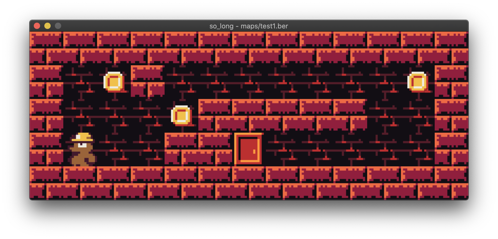

# So Long 🐬

## And thanks for all the fish!

This project is a very small 2D game. Its purpose is to make you work with textures, sprites, and some other very basic gameplay elements.

Video showing the game: [https://youtu.be/GG_RffnJ-9A](https://youtu.be/GG_RffnJ-9A)



# Sprites and artwork

All the sprites used for this project were made by the wonderful **`@Riesco_144`** ✨

Check him out on Twitter: [https://twitter.com/Riesco_144](https://twitter.com/Riesco_144)

# Program

## Initial installation

```
git clone https://github.com/magnitopic/so_long.git
cd so_long
git submodule init
git submodule update
```

## Compilation

> Make sure you have `MiniLibX` installed

```
make
```

## Usage

> **Note:** Only files with `.ber` extension can be used

```
./so_long [MAP_FILE.ber]
```

# How to play

The objective of the game is to collect all the coins spread out across the map and then exit through the door in the smallest amount of moves.

### Actions

| Keyboard | Action        |
| -------- | ------------- |
| `W`, `↑` | Move up       |
| `A`, `←` | Move left     |
| `S`, `↓` | Move down     |
| `D`, `→` | Move right    |
| `Esc`    | Exit the game |
